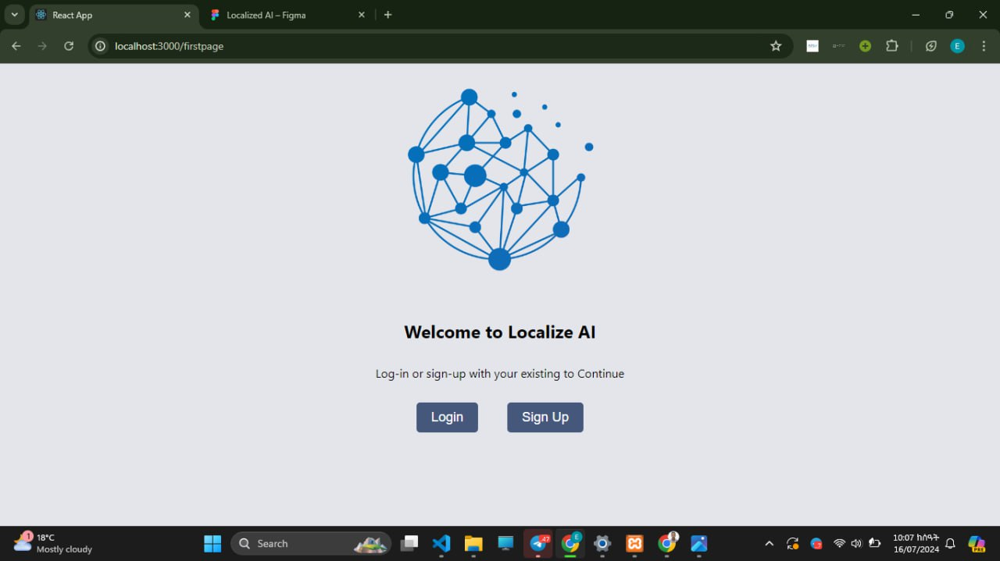
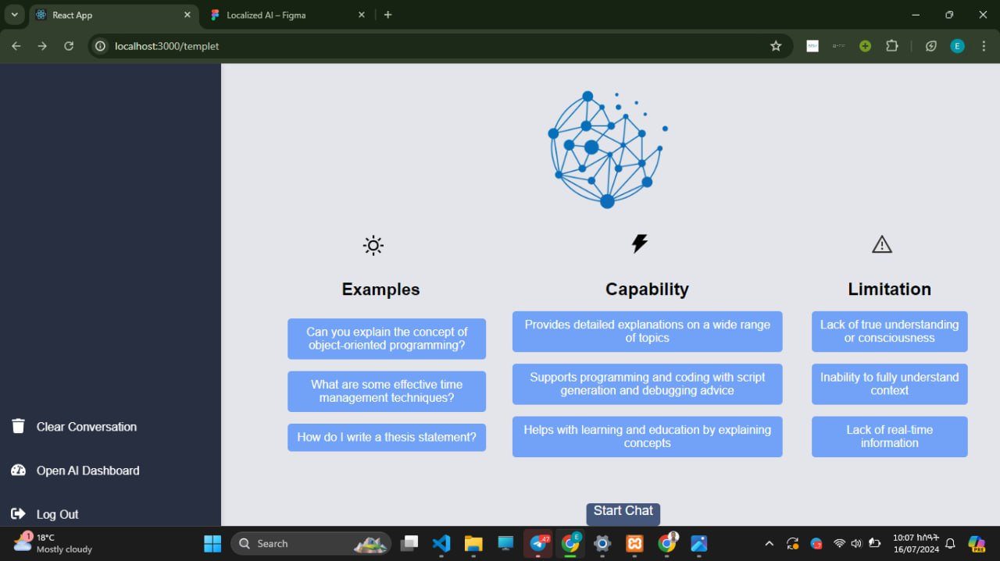
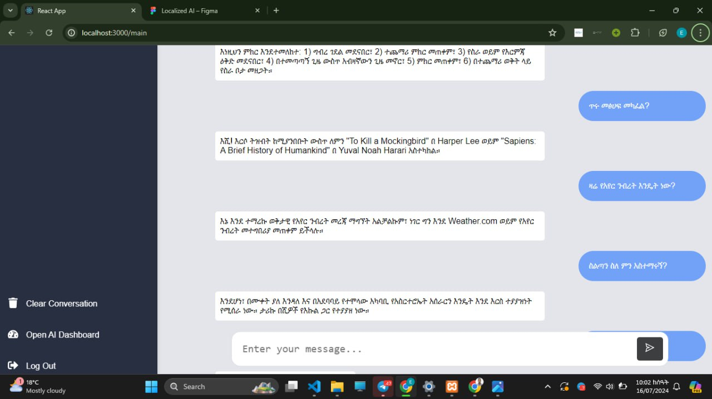
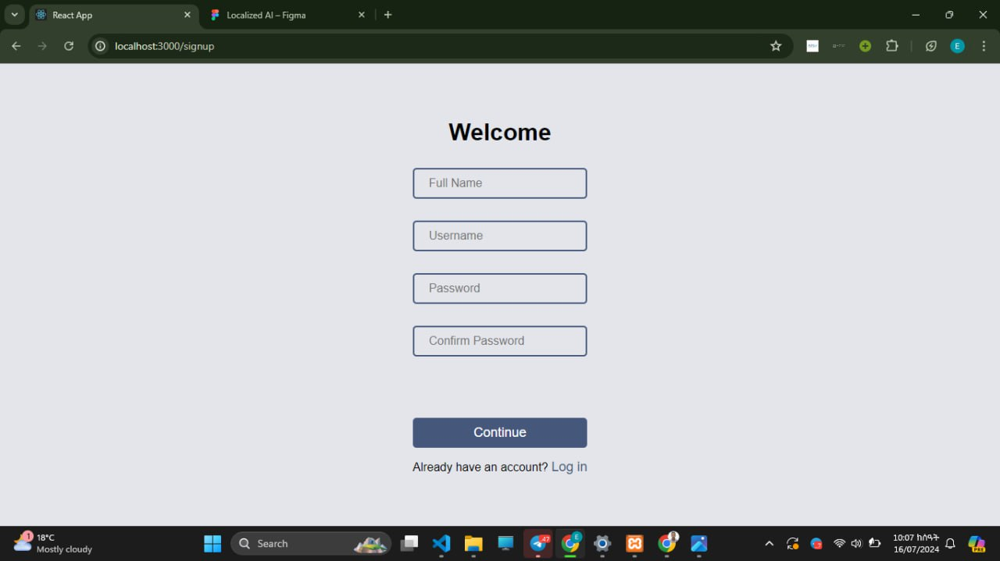

# Localize AI

Localize AI is a groundbreaking project designed to help non-English users across Ethiopia access the full power of generative AI. By leveraging **Gemini Generative AI** and **Amazon Translate**, this platform breaks language barriers, providing users with comprehensive AI features in their native languages.

## Features

- **Multilingual Support:** Translate text and interact with generative AI in multiple Ethiopian languages.
- **Gemini Generative AI Integration:** Utilize state-of-the-art generative AI for text generation, content creation, and more.
- **Amazon Translate:** Seamlessly translates queries and responses between English and other Ethiopian languages, allowing for a more inclusive AI experience.
- **Enhanced Accessibility:** Aimed at helping non-English speakers fully engage with generative AI technology, making tools like content generation, Q&A, and interactive assistance available to everyone.

## How It Works

1. **User Input:** The user inputs a query in their preferred Ethiopian language.
2. **Translation:** Amazon Translate converts the input into English.
3. **AI Processing:** The translated input is processed using Gemini Generative AI.
4. **Response Translation:** The AI-generated response is translated back into the user’s language using Amazon Translate.
5. **User Output:** The user receives the translated response, allowing them to interact fully with the AI.

## Tech Stack

- **Gemini Generative AI**: Powers the generative AI features.
- **Amazon Translate**: Provides seamless translation between English and Ethiopian languages.
- **Node.js** (or your backend framework): Handles API requests and processing.
- **Frontend Framework**: (e.g., Flutter, React, etc.) for the user interface (if applicable).

### Example

1. Input: "ምን ነው አዲሱ ስራ?"
2. The system translates and generates an AI response.
3. Output: "ይህ አዲሱ ድርጅት አቋም እንደሆነ እንዲያስተዋውቁት ትቀጠቀማለች።"

### Demo Images
#### Home Page

#### Landing Page

#### Chat Page

#### Sign Up Page

#### Log in Page

## Contributing

We welcome contributions to improve Localize AI! Please follow these steps:
1. Fork the repository.
2. Create a feature branch.
3. Make your changes.
4. Submit a pull request.

